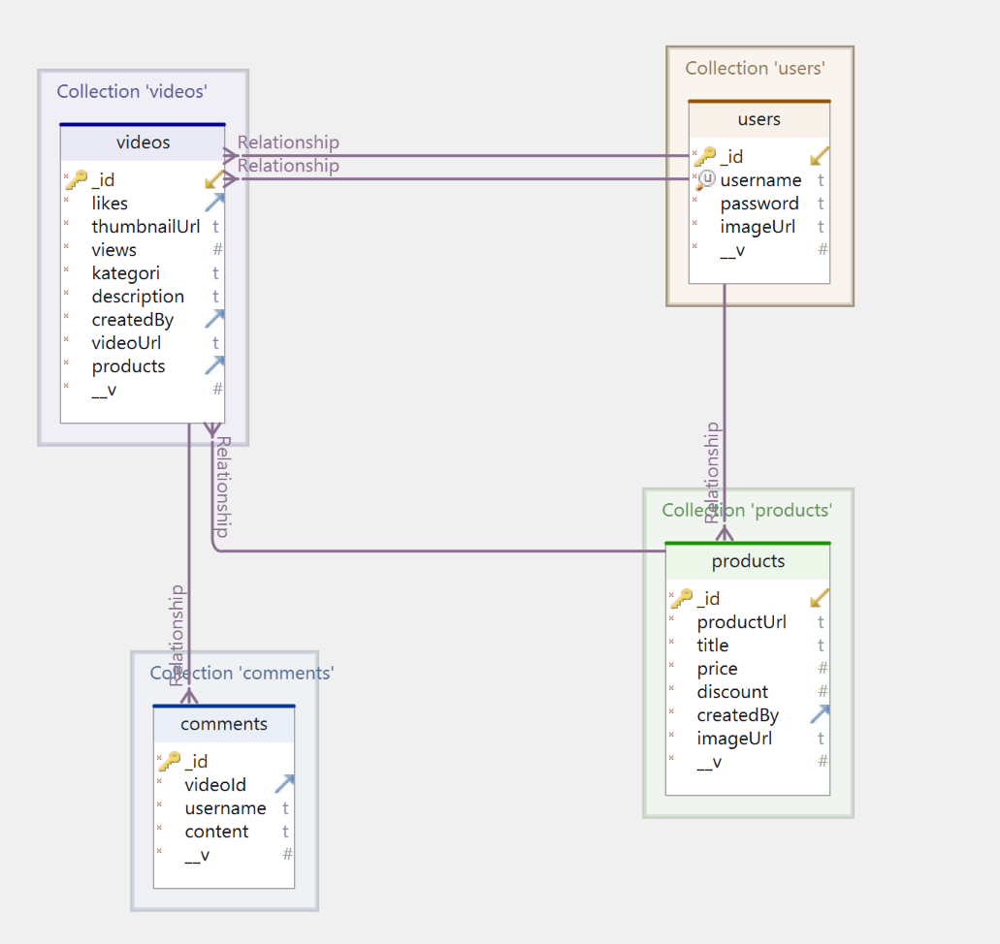

# TokopediaPlayClone-Backend
Mid Term Test

# How To Run Project
1. fill the .env.example and rename into .env
2. Run the project
```text
npm install
npm run start
```

# API STRUCTURE
This project using N-Layer Architecture or Multilayer Architecture (Modular)

## Foldering Structure
```text

C:.
|   .env
|   .env.example
|   .gitignore
|   package-lock.json
|   package.json
|   README.md
|   tree.txt
|   tsconfig.json
|                   
\---src
    |   router.ts
    |   server.ts
    |   
    +---config
    |   \---database
    |           mongo.ts
    |           
    +---middleware
    |   +---authentication
    |   |       auth.ts
    |   |       
    |   \---error
    |           errorHandler.ts
    |           
    +---product
    |       product.controller.ts
    |       product.interface.ts
    |       product.model.ts
    |       product.repository.ts
    |       product.routes.ts
    |       product.service.ts
    |       
    +---user
    |       user.controller.ts
    |       user.interface.ts
    |       user.model.ts
    |       user.repository.ts
    |       user.routes.ts
    |       user.service.ts
    |       
    +---utils
    |   +---common
    |   |       helper.ts
    |   |       
    |   \---error
    |           AppError.ts
    |           error.interface.ts
    |           errors.ts
    |           
    \---video
        |   video.controller.ts
        |   video.interface.ts
        |   video.model.ts
        |   video.repository.ts
        |   video.routes.ts
        |   video.service.ts
        |   
        \---comment
                comment.model.ts
                comment.repository.ts
                
```

# Database Schema



# List API Request And Response
## Users
* User object
```
{
  id: ObjectId
  username: string
  password: string
  imageUrl: string
}
```
**GET /users**
----
get self request user,
* **URL Params**  
  None
* **Data Params**  
  None
* **Headers**  
* Authorization: Bearer `<OAuth Token>`
* Content-Type: application/json
* **Success Response:**
* **Code:** 200  
  **Content:**
```
{
  data:{
        username: string,
        imageUrl: string
  }
}
```


**POST /users/login**
----
login to get token for authentication 
* **URL Params**  
  None
* **Headers**  
  Content-Type: application/json
* **Data Params**
```
  {
    username: string,
    password: string
  }
```
* **Success Response:**
* **Code:** 200  
  **Content:**  
```
{ 
    data : {
            token: string
    } 
}
```

**POST /users/register**
----
register user
* **URL Params**  
  None
* **Data Params**
```
{
    username: string,
    password: string,
    imageUrl: string
}
```
Notes:
Username must be unique
* **Headers**  
  Content-Type: application/json
* **Success Response:**
* **Code:** 200  
  **Content:**  
```
{
    data: {
        message: "User registered successfully"
    }
}
```

# Products
* Product object
```
{
        id: ObjectId,
        productUrl: string,
        title: string,
        price: integer,
        discount: integer,
        createdBy: ObjectId,
        imageUrl: string
}
```

**GET /products**
----
Returns the specified product.
* **URL Params**  
  None
* **Data Params**  
  None
* **Headers**  
  Content-Type: application/json
* **Success Response:**
* **Code:** 200  
  **Content:**
```
{
  "data": [
  <product_object>,
  <product_object>
  ]
}
```

**POST /products**
----
Creates a new Product and returns the new object.
* **URL Params**  
  None
* **Data Params**
```
{
    productUrl: string,
    title: string,
    price: integer,
    discount: integer,
    imageUrl: string
}
```
* **Headers**  
  Content-Type: application/json
  Authorization: Bearer `<OAuth Token>`
* **Success Response:**
* **Code:** 200  
  **Content:**  `{ data: <product_object> }`

#Videos
* Video object
```
{
        _id: ObjectId,
        likes: [
            UserObjectId, 
            UserObjectId,
            ...
        ],
        thumbnailUrl: string,
        views: integer,
        category: string,
        description: string,
        createdBy: UserObjectId,
        videoUrl: string,
        products: [
            ProductObjectId,
            ProductObjectId,
            ...
        ],
}

```
* Comment Object
```
{
        videoId: VideoObjectId,
        username: string,
        content: string,
        _id: ObjectId,
}
```

**GET /videos/:VideoId**
----
Return the specified video.
* **URL Params**  
  None
* **Data Params**  
  None
* **Headers**  
  Content-Type: application/json
* **Success Response:**
* **Code:** 200  
  **Content:**
```
{
    data: <video_object>
}
``` 

**GET /videos/search?query=<keyword>**
----
Return the video that has key of description or category of that keyword.
* **URL Params**  
  None
* **Data Params**  
  None
* **Headers**  
  Content-Type: application/json
* **Success Response:**
* **Code:** 200  
  **Content:**
```
{
    data: [<video_object>, ...]
}
``` 


**GET /videos/:VideoId/product**
----
Returns all Products associated with the specified video.
* **URL Params**  
  *Required:* `VideoId=[ObjectId]`
* **Data Params**  
  None
* **Headers**  
  Content-Type: application/json
* **Success Response:**
* **Code:** 200  
  **Content:**  
```
{ 
  data: [ 
    <product_object>, 
    <product_object>, 
    ... 
  ] 
}
```

**POST /videos/:VideoId/product**
----
Create product associated with the specified video.
* **URL Params**  
  *Required:* `VideoId=[ObjectId]`
* **Data Params**  
  None
* **Headers**  
  Content-Type: application/json  
  Authorization: Bearer `<OAuth Token>`
* **Success Response:**
* **Code:** 200  
  **Content:**
```
{
    data: <video_object>
}
```

**GET /videos/:VideoId/comments**
----
Return all comment of the video with id=VideoId
* **URL Params**  
  *Required:* `VideoId=[ObjectId]`
* **Data Params**  
  None
* **Headers**  
  Content-Type: application/json  
  Authorization: Bearer `<OAuth Token>`
* **Success Response:**
* **Code:** 200  
  **Content:**
```
{ 
  data: [ 
    <comment_object>, 
    <comment_object>, 
    ... 
  ] 
}
```

**POST /videos/:VideoId/comments**
----
Create new comment of the video with id=VideoId
* **URL Params**  
  *Required:* `VideoId=[ObjectId]`
* **Data Params**  
```
{
    content:string
}
```
* **Headers**  
  Content-Type: application/json  
  Authorization: Bearer `<OAuth Token>`
* **Success Response:**
* **Code:** 200  
  **Content:**
```
{
    data: <comment_object>
}
```

**POST /videos/:VideoId/like**
----
like video
* **URL Params**  
  *Required:* `VideoId=[ObjectId]`
* **Data Params**
  None
* **Headers**  
  Content-Type: application/json  
  Authorization: Bearer `<OAuth Token>`
* **Success Response:**
* **Code:** 200  
  **Content:**
```
{
    data: <video_object>
}
```

**POST /videos/:VideoId/unlike**
----
  Unlike video
* **URL Params**  
  *Required:* `VideoId=[ObjectId]`
* **Data Params**
 None
* **Headers**  
  Content-Type: application/json  
  Authorization: Bearer `<OAuth Token>`
* **Success Response:**
* **Code:** 200  
  **Content:**
```
{
    data: <video_object>
}
```
**GET /videos**
----
Return all video list
* **URL Params**  
  None
* **Data Params**  
  None
* **Headers**  
  Content-Type: application/json
* **Success Response:**
* **Code:** 200  
  **Content:**
```
{ 
  data: [ 
    <comment_object>, 
    <comment_object>, 
    ... 
  ] 
}
```

**POST /videos**
----
Create Video
* **URL Params**  
  None
* **Data Params**  
```
{
    thumbnailUrl: string,
    category: string,
    description: string,
    videoUrl: string
}
```
* **Headers**  
  Content-Type: application/json
* **Success Response:**
* **Code:** 200  
  **Content:**
```
{ 
  data: <comment_object> 
}